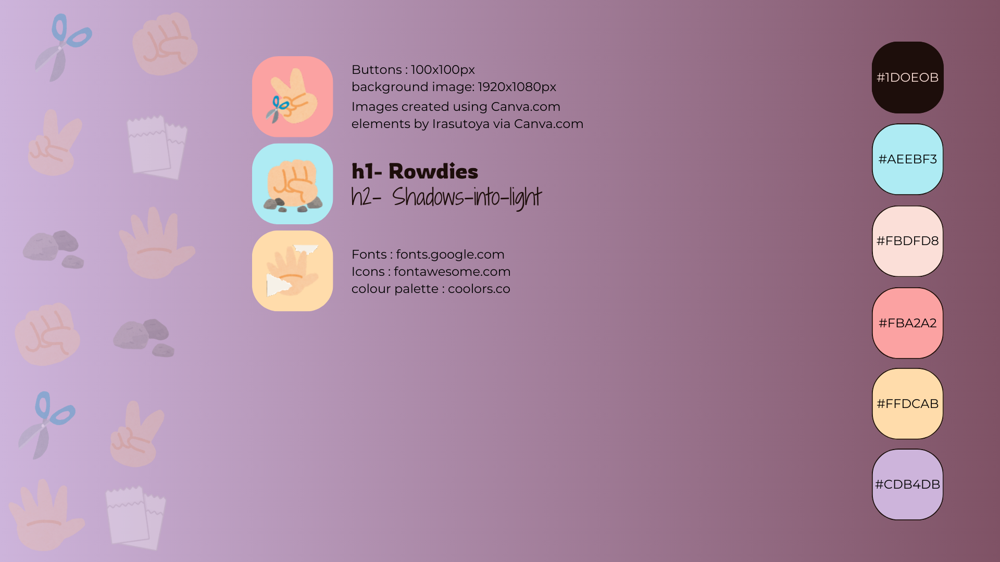
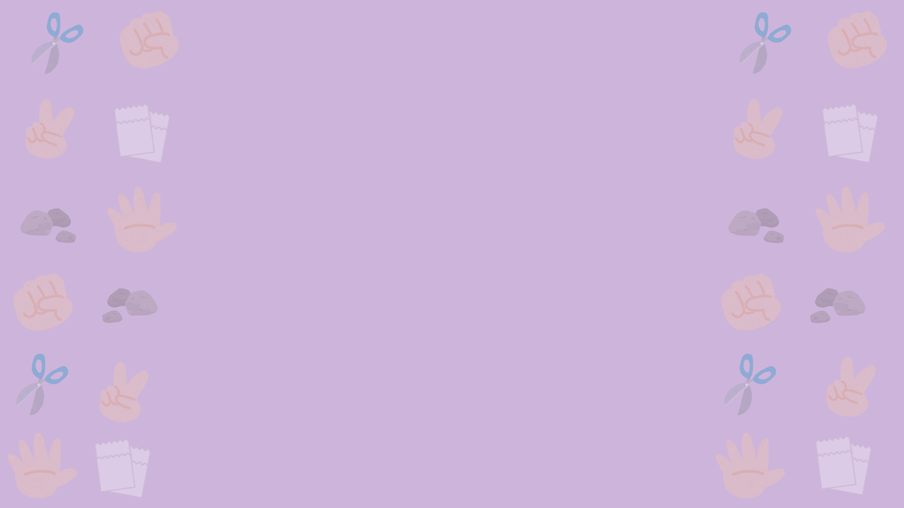
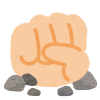
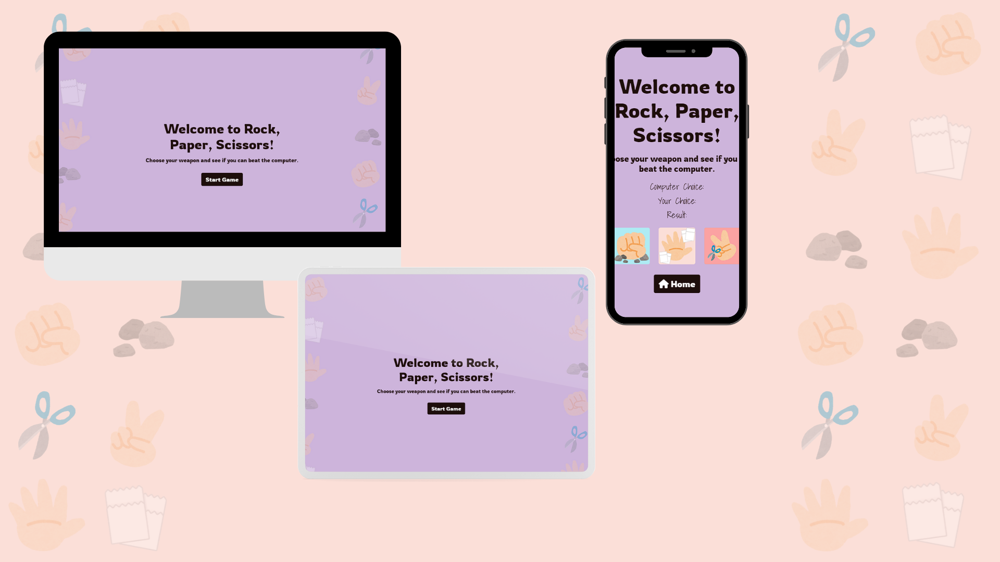

# Rock Paper Scissors Game

Welcome to my milestone project, It is Rock Paper Scissors, an online game where you can test your luck against the computer!

## Description

This project is a simple web-based implementation of the classic game "Rock Paper Scissors". Players can choose their weapon and see if they can beat the computer.

## Installation

To run this project locally, follow these steps:

1. Clone this repository to your local machine.
2. Open the project directory in your code editor.
3. Open `index.html` in your web browser to start the game.

## Usage

1. Once the game is loaded, click on the "Start Game" button to begin.
2. Choose your weapon (rock, paper, or scissors) by clicking on the corresponding button.
3. See the computer's choice and the result of the game displayed on the screen.
4. To play again, click on the "Home" button to return to the landing page.

## Testing

To run tests for this project using Jest:

1. Install Jest by running `npm install --save-dev jest`.
2. Navigate to the `__tests__` directory.
3. Write test cases for each function in your JavaScript file.
4. Run tests using the command `npm test`.
## Styling 

- 
- 
- 
- 
- 

1. The game is responsive over a number of devices. 

## Languages Used

- HTML5
- CSS
- JavaScript

## Frameworks,Libraries & Programs

- [**Bootstrap**](https://getbootstrap.com): Responsiveness and Styling
- [**Google Fonts**](https://fonts.google.com/): Fonts used in the project.
- [**FontAwesome**](https://fontawesome.com/): Icons used in the project.
- [**Coolors.co**](Coolors.co): Used for generating colour palettes. 
- [**Canva.com**](Canva.com): Used for creating images for choices and background.
- [**YouTube & FreeCodeCamp.org**](https://www.youtube.com/watch?v=ec8vSKJuZTk&t=326s): Sources of inspiration and learning.[Learn JavaScript by Building 7 Games](https://www.youtube.com/watch?v=ec8vSKJuZTk&t=326s) -- I used the code given in the first part of this video and built up from it --
- **CodeInstitute GitHub Repository Template**: Used as a project structure template.

## Testing

- W3C HTML  [index.html](assets/images/Nu%20HTML%20Checker%20Index.html.png)[game.html](assets/images/Nu%20HTML%20Checker%20game.html.png)
- W3C CSS  [CSS test](assets/images/W3C%20CSS%20.png)
- JSHint  [JS Test](assets/images/js%20test%20jshint.png)

## User Stories

1. As a player, I want to be able to choose between rock, paper, and scissors.
2. As a player, I want to see the computer's choice.
3. As a player, I want to see the result of the game.
4. As a player, I want to be able to restart the game.

## Acknowledgements

Special thanks to all the contributors and resources that helped in the development of this project.

